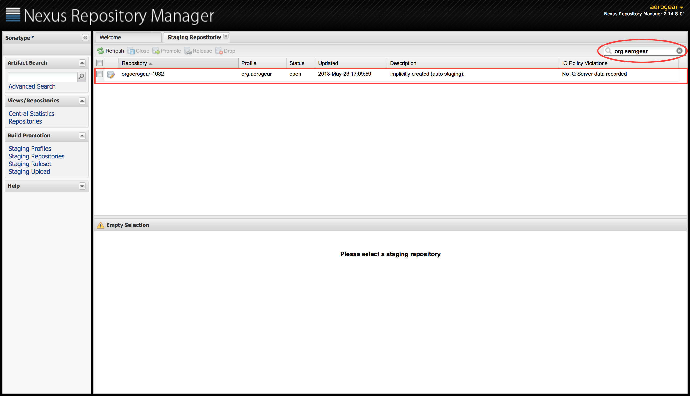
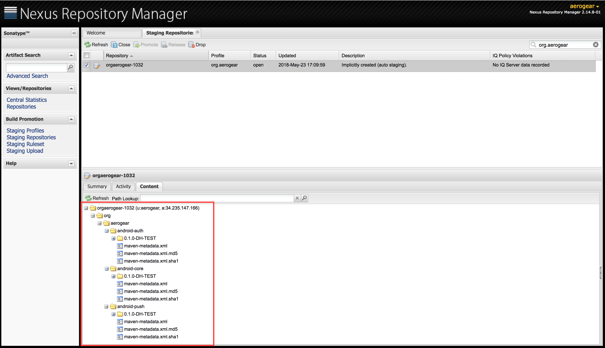
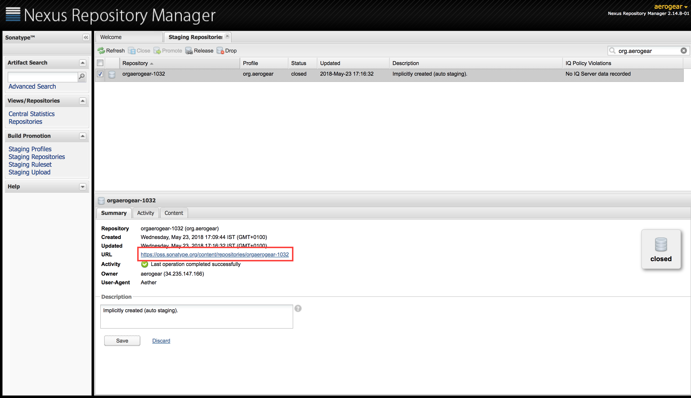

== SDK Release Documentation

The release process results in new versions of the Core and associated SDKs being published on Maven. This docmument should help you understand how releases work and how to create one.

=== How Releases Work

There are a number of stages in the process. Some are automated and some are manual. At a high level, releases work as follows:

* The release artefacts are created and pushed to link:https://oss.sonatype.org/#stagingRepositories[Nexus]. 
* The developer logs into Nexus and creates a temporary repository where the release artefacts can be downloaded and tested (if necessary).
* The developer then uses Nexus to push the release artefacts to Maven.

The initial step where the release artefacts are built and pushed to Nexus is automated in CircleCI

=== CircleCI Release Job

CircleCI is responsible for the initial build and push to Nexus. CircleCI notices a new release being created and kicks off a special release workflow. The following steps take place:

* A standard build job runs, i.e. the code is built and tested.
* If the build is successful then a release job runs.
  ** The `VERSION_NAME` and `VERSION_CODE` in `gradle.properties` are validated.
  ** The Release tag is validated to make sure it matches the version number in `gradle.properties`
  ** The Core and associated SDKs are released to link:https://oss.sonatype.org/#stagingRepositories[Nexus.]

A small amount of preparation needs to take place before this process kicks off. The version number must be updated in `gradle.properties`

=== How to Prepare a Release

Ensure the git repo is clean and there are no outstanding changes. Then check out a new branch.

[source, bash]
--
git checkout -b release-x.y.z
--

Update the `VERSION_NAME` property in the `gradle.properties` file at the root of the repository. The `VERSION_NAME` **must be in the format x.y.z or x.y.z-label**

Update the `VERSION_CODE` property. It **must be a number.**

Use `git status` to verify that only the `gradle.properties` file has been updated.

[source, bash]
--
$ git status
On branch release-x.y.z
Changes not staged for commit:
  (use "git add <file>..." to update what will be committed)
  (use "git checkout -- <file>..." to discard changes in working directory)

        modified:   gradle.properties
--

Commit and push these changes, then open a Pull Request to `master`.

[source, bash]
--
git commit -am 'release version x.y.z'
--

Once your changes have been merged to master, you can continue with the automated release to Nexus.

=== How to Release

To kick off a release to Nexus, simply link:https://help.github.com/articles/creating-releases/[Create a Release] in Github. **You must use the new `VERSION_NAME` value** for the release tag or the release will fail.

This will kick off the automatic release process in CircleCI. After a few minutes the new artefacts should be available in Nexus.

=== Log into Nexus and Release to Maven Central

Accounts for Nexus are created through their JIRA system. You must link:https://issues.sonatype.org/secure/Signup!default.jspa[sign up here]. Once signed up, you will need to ask one of your team members that already has access to grant you access to the appropriate project(s).

* Log into link:https://oss.sonatype.org/[Nexus]
* Go to link:https://oss.sonatype.org/#stagingRepositories[Staging Repositories.]
* Find the aerogear repository by searching for `org.aerogear`

* Click the content tab and ensure everything looks good and all the files are there.

* Click the Close button. This process will perform some checks such as checking signatures and javadocs. You can click the refresh button in the Nexus UI to watch the checks completing.
* If successful, a temporary public repository is created. The URL for this repository is displayed. This can be used to to test out the release before releasing to Maven.

* Once you are ready to release to Maven, click the release button. The artefacts should be available in Maven after 2-3 hours.
