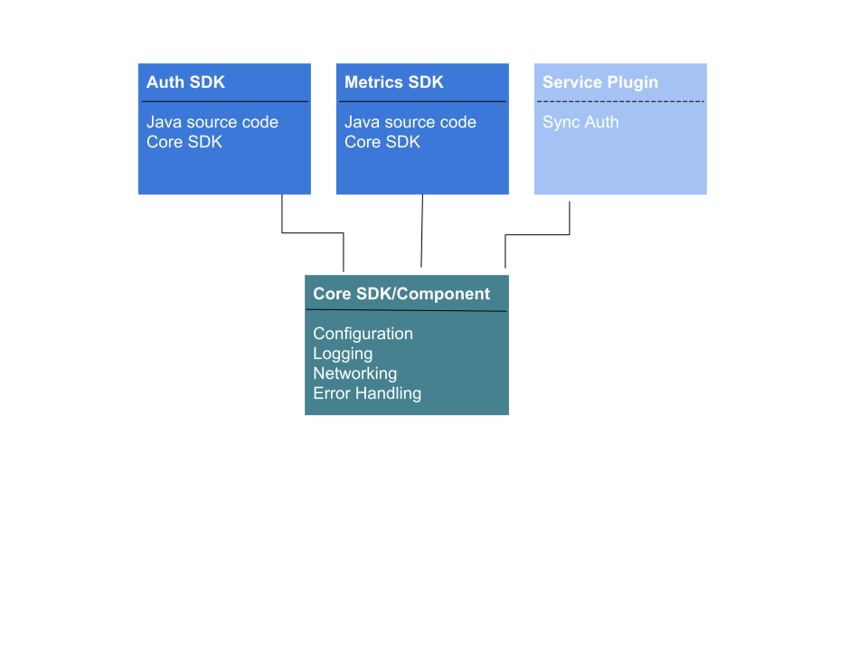

== AeroGear Service Developer Guide

Following guide describes architecture for Android SDK and instructions for developing new AeroGear Services.

For instructions about using SDK in user applications please follow link:./getting-started.adoc[User Getting Started Guide]

=== SDK architecture

SDK aggregates individual services SDK into one single manageable namespace. Services like AeroGear Sync, Push are build as separate SDK's that can be included into any existing or new Android applications. SDK using gradle for dependency resolution and distribution. Each SDK is represented as separate gradle module. Modules are used and are tested in `example` application that is also used for building and demo purposes. 

Central element of the SDK is the `core` module that is responsible for reading configuration and instantiating individual SDK's that implement `ServiceModule` class. Both users and individual SDK components can interact with Core SDK api in order to avoid strict dependencies. Every SDK is fully independent from each other and interacts with core interfaces. 

== Creating a new SDK in this repository

This section walks through adding a new SDK Module project to the SDK repository.

=== Creating the project

New Service Modules in this repository should be created under the `org.aerogear.mobile.x` namespace.

See the [`keycloak-service-module`](../keycloak-service-module/build.gradle) for examples.

=== Via Android Studio

1. Create a new Android Library module by navigating to `File > New > New Module...` and selecting the `Android Library` option.
2. Input the new module name and ensure it is created under the `org.aerogear.mobile.x` namespace. Ignore the value of the `Minimum SDK` field for now.
3. After the module is created, update the fields in the generated `build.gradle` file to target the corresponding constants in the [`constants.gradle`](../constants.gradle) file:
[source,groovy]
----
apply plugin: 'com.android.library'

android {
    compileSdkVersion project.ext.compileSdkVersion

    defaultConfig {
        minSdkVersion project.ext.minSdkVersion
        targetSdkVersion project.ext.targetSdkVersion
        versionCode 1
        versionName "1.0"
----

=== Manually/Via a terminal

1. Create a new folder in the root of the repository with the `/name-module` suffix, with a `build.gradle` and `gradle.properties` file describing it.
2. The `compileSdkVersion`, `minSdkVersion` and `targetSdkVersion` must target the corresponding constants in the [`constants.gradle`](../constants.gradle) file:
[source,groovy]
----
apply plugin: 'com.android.library'

android {
    compileSdkVersion project.ext.compileSdkVersion

    defaultConfig {
        minSdkVersion project.ext.minSdkVersion
        targetSdkVersion project.ext.targetSdkVersion
        versionCode 1
        versionName "1.0"
----
3. Add the new module to the root [`settings.gradle`](../settings.gradle).

== Implementing SDK service class

Every SDK module needs to implement `ServiceModule` interface. 
This class will be used to instantiate objects in the core and provide configuration specific for SDK.

[source,java]
----
public class MyService implements ServiceModule {

    @Override
    public void configure(final MobileCore core, final ServiceConfiguration serviceConfiguration) {
        // Initialize your class from configuration
        String url = serviceConfiguration.getUri();
    }

    @Override
    public String type() {
        return "name-of-sdk";
    }

    @Override
    public void destroy() {
        // Destroy SDK
    }
}
----
